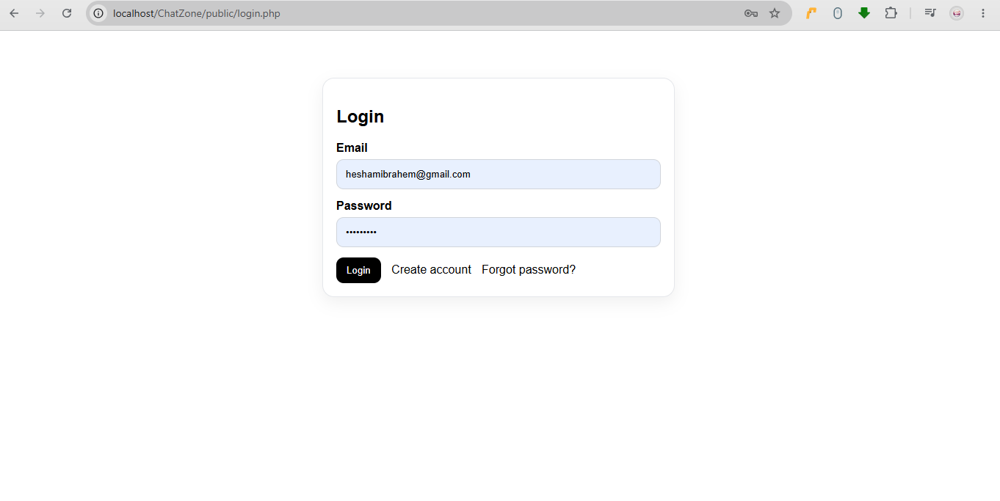
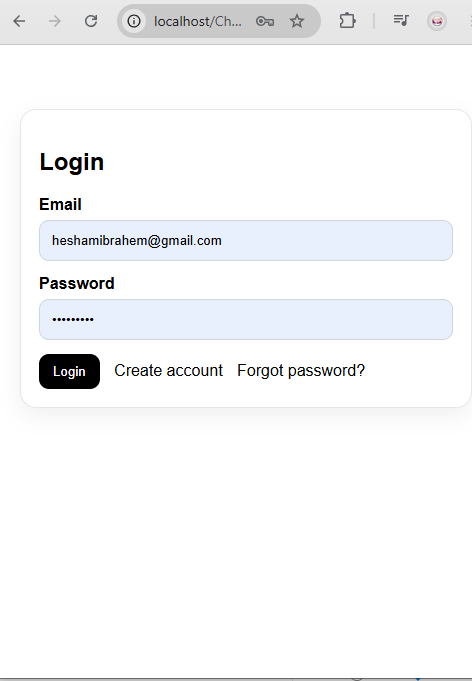
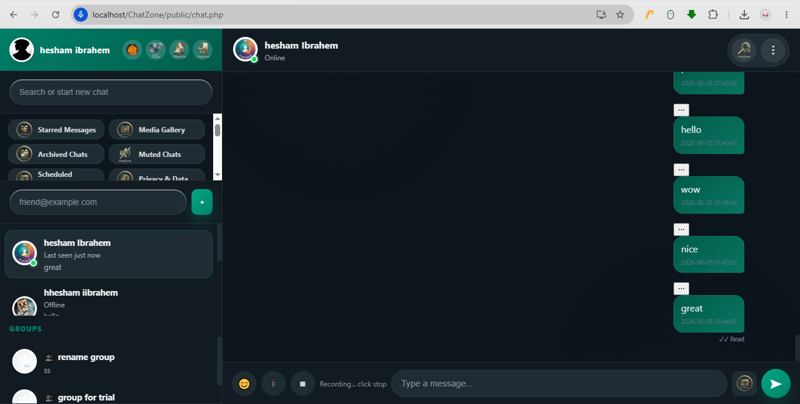
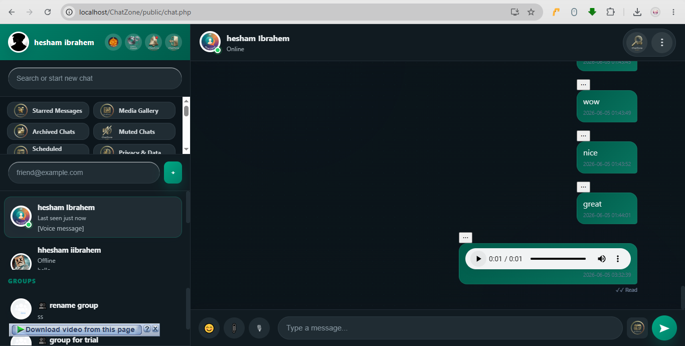
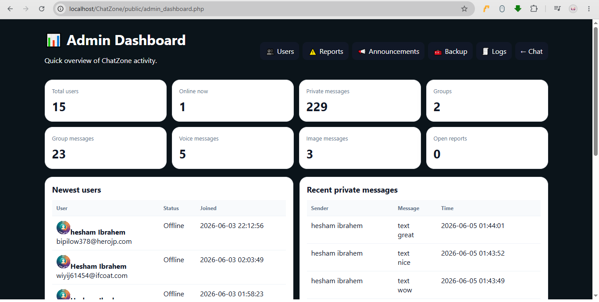

# ChatZone

A modern real-time messaging platform built with PHP, MySQL, JavaScript, and WebSockets.

ChatZone provides private messaging, group conversations, voice messages, media sharing, real-time presence updates, read receipts, typing indicators, and a complete administration panel.

---

## Features

### Messaging

* Private conversations
* Group chats
* Voice messages
* Message reactions
* Reply to messages
* Forward messages
* Mentions (@username)
* Read receipts
* Typing indicators
* Online / Last Seen status
* Infinite scrolling
* Media gallery
* Message search

### Real-Time Communication

* WebSocket-based message delivery
* Real-time typing updates
* Live presence tracking
* Instant message synchronization

### User Management

* User registration
* Email verification
* Password reset
* Two-Factor Authentication (2FA)
* Profile management
* User blocking

### Administration

* Admin dashboard
* User management
* Announcements system
* Reports management
* Login attempt monitoring
* System health monitoring
* Error log viewer
* Storage monitoring
* Backup management
* Maintenance mode

### User Experience

* Responsive design
* Mobile-friendly interface
* Dark mode support
* Optimized chat loading
* Automatic scroll management
* Real-time updates without page refresh

---

## Technology Stack

### Backend

* PHP 8+
* MySQL / MariaDB
* PDO Database Layer

### Frontend

* HTML5
* CSS3
* JavaScript (ES6+)

### Real-Time

* WebSockets

### Security

* CSRF Protection
* Password Hashing
* Two-Factor Authentication
* Session Management
* Input Validation

---

## Project Structure

```text
ChatZone/
├── public/
│   ├── assets/
│   │   ├── css/
│   │   ├── js/
│   │   ├── img/
│   │   └── uploads/
│   ├── ajax/
│   ├── includes/
│   ├── websocket/
│   └── admin/
├── database/
├── logs/
└── docs/
```

---

## Installation

### Requirements

* PHP 8.0+
* MySQL 5.7+ or MariaDB
* Apache / Nginx
* WebSocket Server

### Setup

1. Clone the repository

```bash
git clone https://github.com/your-username/chatzone.git
```

2. Import the database

```sql
Import chatzone.sql
```

3. Configure database credentials

```php
config/database.php
```

4. Start Apache and MySQL

5. Start WebSocket server

```bash
php websocket/server.php
```

6. Open the application

```text
http://localhost/ChatZone
```

---

## Security Features

* Password hashing using PHP password_hash()
* CSRF token validation
* Session protection
* Login attempt monitoring
* Two-Factor Authentication
* Email verification
* User blocking system

---

## Performance Optimizations

* Infinite scroll loading
* Event-driven updates
* WebSocket communication
* Optimized database queries
* Reduced page refreshes
* Scroll position preservation

---

## Screenshots

Add screenshots of:

* Login Page
        PC:
            
        phone:
            
* Private Chat
    Light Mode:
        PC:
            
        phone:
            
    Dark Mode:
        PC:
            
        phone:
            
* Group Chat
    Light Mode:
        PC:
            
        phone:
            
    Dark Mode:
        PC:
            
        phone:
            
* Voice Messages
            
            
* Admin Dashboard
            
* Media Gallery
            

---

## Author

Developed by Hesham Ibrahim

Electrical Engineer & Full Stack Developer

GitHub:
https://github.com/heshamibrahem1999

---

## License

This project is provided for educational and portfolio purposes.
